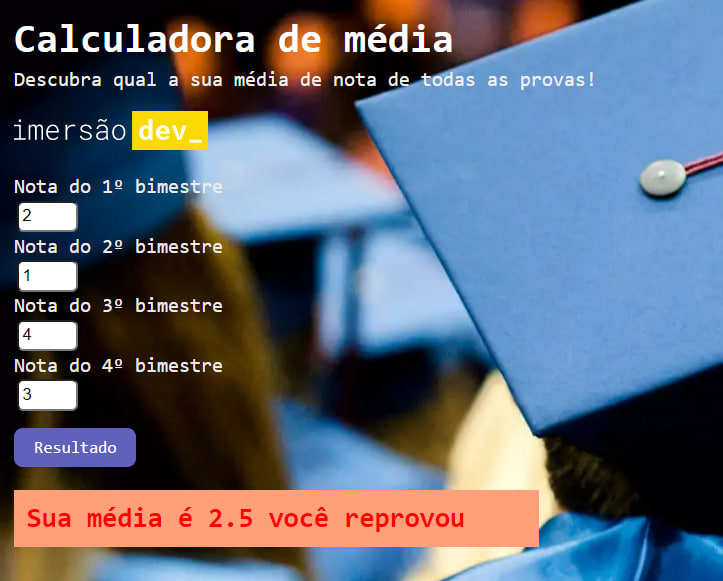

# Calculadora de média

<h2>Empower Code for Woman</h2>

O <em>Empower Code for Women</em> é um programa de capacitação em programação realizado pela empresa Zenvia em parceria com a Alura, uma escola de tecnologia. O bootcamp tem como finalidade capacitar e mentorar 100 mulheres para a área de tecnologia.

##

<h2>O projeto</h2>
<h3>Calculadora de Média</h3>

Esse foi um dos primeiros projetos desenvolvido em aula, utilizando foco principal no JavaScript para calcular uma média de notas e aparecer mensagem dferente caso a pessoa tenha sido aprovada ou não.

<a href=https://santosfer.github.io/calculadora-de-media/>Acesse o projeto aqui</a>

 

